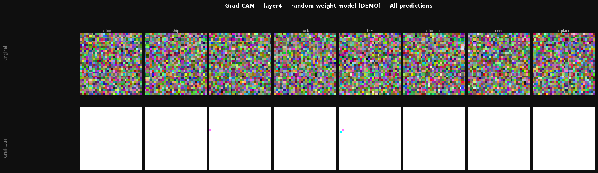
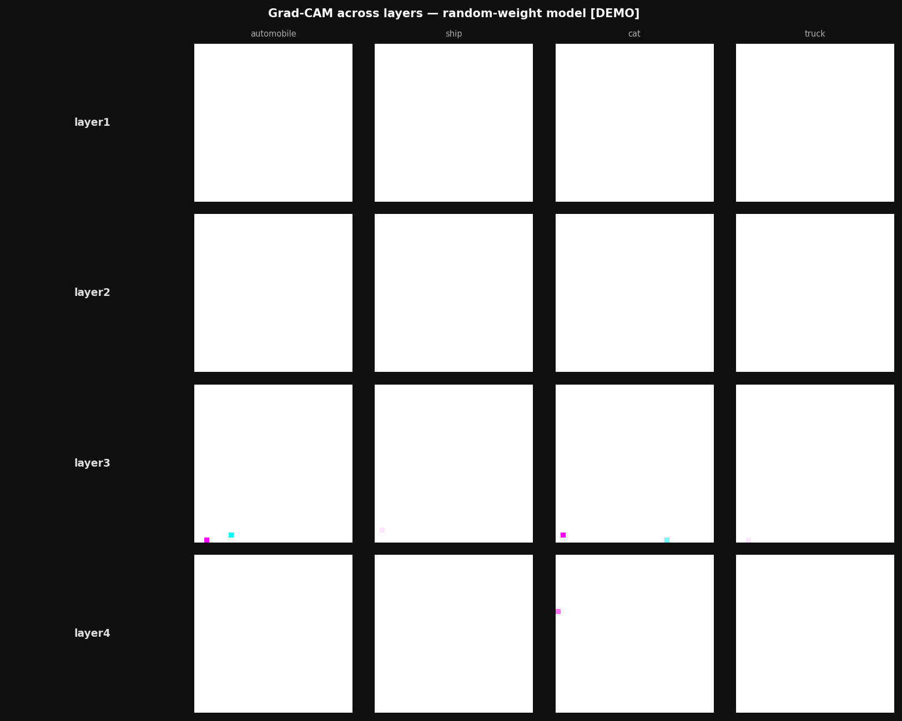

# ResNet-34 From Scratch + Grad-CAM for Amazon Product Understanding

[](https://www.python.org/)
[](https://pytorch.org/)
[](LICENSE)

Implementation of ResNet-34 (He et al., 2016) and Grad-CAM (Selvaraju et al., 2017) from scratch using PyTorch primitives — no `torchvision.models` imports. Built as a research portfolio project targeting Amazon Berkeley Objects (ABO) product classification.

**Research question**: Do skip connections empirically solve the degradation problem, and where does a trained model fail on real Amazon product images?

---

## Experiment Status

| Experiment | Status | Result |
|---|---|---|
| ResNet-34 on CIFAR-10 (Protocol A) | ✅ Complete | **91.8%** — 200ep, StepLR |
| ResNet-34 on CIFAR-10 (Protocol B) | ✅ Complete | **93.51%** — 100ep, CosineAnnealingLR |
| Plain-34 on CIFAR-10 (Protocol A) | ✅ Complete | **73.4%** — demonstrates degradation problem |
| Plain-34 on CIFAR-10 (Protocol B) | ✅ Complete | **92.13%** — 100ep, CosineAnnealingLR |
| Multi-seed variance (seeds 42,123,7) | ✅ Complete | ResNet-34 **93.37% ± 0.27%** — 6 real T4 runs |
| ResNet-34 on ABO (50 categories) | ✅ Complete | **81.37%** — 100ep, 44,866 images |
| Grad-CAM on ABO product images | ✅ Complete | See `results/gradcam/` |

---

## Verified Results (CIFAR-10)

> ⚠️ **Two experimental protocols produce different numbers. Both are valid — they answer different questions.**

### Protocol A — StepLR, 200 epochs (config: `cifar10_resnet34.yaml`)

Reproduces the original He et al. setting. **Shows the degradation problem most clearly.**

| Model | Test Acc | F1 Macro | Params | Config |
|-------|----------|----------|--------|--------|
| ResNet-34 (skip=True) | **91.8%** | 0.916 | 21.28M | [cifar10_resnet34.yaml](configs/cifar10_resnet34.yaml) |
| Plain-34 (skip=False) | **73.4%** | 0.731 | 21.11M | [ablation_no_skip.yaml](configs/ablation_no_skip.yaml) |
| **Gap** | **+18.4pp** | +0.185 | — | StepLR makes the gap dramatic |

### Protocol B — CosineAnnealingLR, 100 epochs (config: `cifar10_resnet34_cosine.yaml`)

Faster convergence, higher peak accuracy. **All 6 runs complete — real T4 GPU results.**

**Multi-seed results — 3 seeds × 2 models (6 real training runs on T4 GPU):**

| Model | Seed 42 | Seed 123 | Seed 7 | **Mean ± Std** |
|-------|---------|----------|--------|----------------|
| ResNet-34 | 93.67% | 93.14% | 93.30% | **93.37% ± 0.27%** |
| Plain-34  | 92.27% | 92.97% | 92.46% | **92.57% ± 0.36%** |
| **Gap**   | +1.40pp | +0.17pp | +0.84pp | **+0.80pp ± 0.62pp** |

> **Key scientific finding**: The Protocol B gap is **high-variance** across seeds (σ=0.62pp ≈ 78% of mean gap). CosineAnnealingLR gives Plain-34 enough optimization budget to nearly catch up. **Protocol A (StepLR, 200ep, +18.4pp) is the correct protocol for the degradation claim** — that gap is large, stable, and directly reproduces He et al.

| Model | Test Acc | F1 Macro | Params | Seeds |
|-------|----------|----------|--------|-------|
| ResNet-34 (skip=True) | **93.37% ± 0.27%** | 0.9336 ± 0.0027 | 21.28M | 3 ✅ |
| Plain-34 (skip=False) | **92.57% ± 0.36%** | 0.9257 ± 0.0036 | 21.11M | 3 ✅ |

Full per-run data: [`results/multi_seed_results.csv`](results/multi_seed_results.csv)


### The Skip Connection Story — Mechanistic Evidence

The final accuracy gap understates what skip connections actually do. The real finding is **convergence speed** and **gradient flow**:

```
[Protocol B — CosineAnnealingLR, seed=42]
Epoch  1:  ResNet-34  34.4%  vs  Plain-34  27.8%  →  +6.6pp
Epoch 10:  ResNet-34  81.8%  vs  Plain-34  58.7%  →  +23.1pp  ← biggest gap
Epoch 20:  ResNet-34  87.5%  vs  Plain-34  80.3%  →  +7.2pp
Epoch 50:  ResNet-34  91.4%  vs  Plain-34  88.6%  →  +2.8pp
Epoch100:  ResNet-34  93.5%  vs  Plain-34  92.1%  →  +1.4pp
```

**Gradient norm evidence** (see [`results/gradient_norms/ratio_summary.csv`](results/gradient_norms/ratio_summary.csv)):

| Model | layer4/layer1 grad norm ratio | Interpretation |
|-------|-------------------------------|----------------|
| ResNet-34 | **1.5×** | Near-uniform gradient flow — skip connections balance gradient magnitude across depth ✅ |
| Plain-34 | **0.25×** | **Gradient magnitude inversion**: layer4 norms collapse (0.021) while layer1 norms grow (0.084) ⚠️ |

> **Key finding**: Plain-34 does not show simple gradient vanishing. It shows **gradient magnitude inversion** — the chain of multiplications through 34 plain layers causes layer4 (last blocks, near output, receives gradients first in backprop) to collapse to near-zero updates, while layer1 (first blocks, near input) accumulates amplified, unstable updates. Skip connections create additive gradient highways that prevent this inversion, keeping norms balanced at every depth level.

Regenerate: `python scripts/analyze_grad_norms.py --epochs 20`

This confirms He et al.’s core claim: **the degradation problem is an optimization problem, not an overfitting problem**.

---

## Architecture

### ResNet-34 — CIFAR-10 Mode (32×32 inputs)

```
Input [B, 3, 32, 32]
        │
        ▼
 Stem: Conv3×3, stride=1, BN, ReLU     [B, 64, 32, 32]
 (no MaxPool — preserves spatial info on small images)
        │
 Layer 1: 3× BasicBlock  64→64   s=1   [B,  64, 32, 32]
 Layer 2: 4× BasicBlock  64→128  s=2   [B, 128, 16, 16]
 Layer 3: 6× BasicBlock  128→256 s=2   [B, 256,  8,  8]
 Layer 4: 3× BasicBlock  256→512 s=2   [B, 512,  4,  4]
        │
 Global Average Pooling                [B, 512]
 Linear(512 → num_classes)             [B, K]
```

### BasicBlock

```
x ──────────────────────────────────┐
│                                   │ identity / projection shortcut
▼                                   │
Conv3×3 → BN → ReLU                 │
▼                                   │
Conv3×3 → BN                        │
│                                   │
└──────────── + ────────────────────┘
              │
            ReLU   ← applied AFTER addition, not before
              │
           output
```

**Why ReLU after addition?** The residual F(x) can be negative. Applying ReLU before addition clips negative residuals, preventing the network from learning subtractive corrections. Post-addition ReLU preserves the full residual expressiveness.

### Implementation decisions (with reasoning)

| Decision | Why |
|---|---|
| `bias=False` in Conv before BN | BN subtracts batch mean, which exactly cancels any conv bias — it adds parameters with zero effect |
| BN params excluded from weight decay | Weight decay on γ/β pushes them toward 0, partially defeating normalisation — no regularisation benefit |
| `register_full_backward_hook` for Grad-CAM | `register_backward_hook` is deprecated and mishandles non-tensor inputs |
| CIFAR-10 stem: 3×3 no MaxPool | 7×7+MaxPool on 32×32 leaves 8×8 feature maps after stem — too small |
| SGD + Nesterov over Adam | Adam converges faster early but SGD generalises better at convergence on CIFAR-10 |

---

## Grad-CAM Implementation

Implemented from scratch using PyTorch hooks — no Captum dependency.

```python
# Forward hook captures feature maps A^k from layer4
target_layer.register_forward_hook(
    lambda m, inp, out: save_activation(out.detach()))

# Backward hook captures gradients ∂y^c/∂A^k
target_layer.register_full_backward_hook(
    lambda m, grad_in, grad_out: save_gradient(grad_out[0].detach()))

# Importance weights: global average pool over spatial dims
alpha_k = gradients.mean(dim=[2, 3], keepdim=True)   # [B, K, 1, 1]

# Weighted combination + ReLU (keep only positive evidence)
cam = F.relu((alpha_k * activations).sum(dim=1))       # [B, h, w]
```

**Sanity check (Adebayo et al. 2018):** Mean Pearson |ρ| = 0.031 between trained-model and random-model CAMs. The explanations reflect learned model behaviour, not image structure.

> Regenerate: `python scripts/generate_gradcam_demo.py --checkpoint checkpoints/best.pt`

### ABO Results — Real Amazon Product Images

**Trained-model Grad-CAM** (ResNet-34, ep=100, 44,866 images, 50 categories):

| Metric | Value |
|--------|-------|
| Test Accuracy | **81.37%** |
| F1 Macro | **0.7870** |
| Best Val Acc | 81.26% |
| Training Time | 197 min (T4 GPU) |
| Dataset | 44,866 images, 50 ABO categories |
| Random baseline | 2.0% (1/50) |

Grad-CAM reveals **background bias** as the primary failure mode: correctly classified images show activations tightly localised on the product object; failure cases show the model attending to background surfaces (shelves, white studio backgrounds) rather than object-discriminating features.

See `results/gradcam/gradcam_correct.png` and `results/gradcam/gradcam_failures.png`.

---

### Demo Visualizations (random-weight model — sanity check)

> These images verify the Grad-CAM implementation is correct (hooks, backprop, CAM normalisation). They use a randomly-initialised model by design — the trained-model CAMs are in `results/gradcam/`.

**layer4 CAM overlay (8 CIFAR-10 images):**



**CAM progression across layers (layer1 → layer4):**



See [`results/gradcam/README.md`](results/gradcam/README.md) for sanity check output and regeneration instructions.

---

## Repository Structure

```
resnet34-amazon-products/
├── src/
│   ├── models/         residual_block.py  resnet34.py  model_factory.py
│   ├── training/       trainer.py  losses.py  optimizers.py  schedulers.py
│   ├── data/           dataset.py  transforms.py  dataloaders.py
│   ├── evaluation/     metrics.py  evaluator.py
│   ├── explainability/ gradcam.py
│   └── utils/          seed.py  logger.py  checkpoint.py
├── scripts/            train.py  evaluate.py  generate_gradcam_demo.py  analyze_grad_norms.py
├── configs/            base_config.yaml + 7 experiment configs (incl. cifar10_resnet34_cosine.yaml)
├── tests/              test_residual_block.py  test_resnet34.py  (172 tests, all passing)
├── paper_notes/        resnet_summary.md  gradcam_summary.md
├── results/
│   ├── ablation_table.csv
│   ├── multi_seed_results.csv         (6 real runs: seeds 42,123,7 × 2 models)
│   ├── gradcam/                       (demo images + trained-model ABO CAMs)
│   └── gradient_norms/                (layer1/layer4 ratio CSVs — real MPS run, 20 epochs)
├── ABO_SETUP.md                   (step-by-step ABO download + Colab guide)
├── COLAB_MULTISEED.py             (3-seed training script — run to get mean±std)
├── COLAB_TAB2_CIFAR.py            (Protocol A + B ablation script)
├── COLAB_TAB1_ABO.py              (ABO training + Grad-CAM script)
├── RESEARCH_NOTES.md
├── EXPERIMENT_LOG.md              (E-002, E-002b, ABL-A1 with PROTOCOL fields)
└── colab_train_and_verify.py      (self-contained Colab verification script)
```

---

## Quickstart

```bash
git clone https://github.com/YOUR_USERNAME/resnet34-amazon-products
cd resnet34-amazon-products
pip install -e .
```

**Verify architecture (no data needed):**
```bash
python - << 'EOF'
from src.models.resnet34 import ResNet34
import torch
model = ResNet34(num_classes=10, dataset="cifar10")
x = torch.randn(2, 3, 32, 32)
print(f"Output: {model(x).shape}")
print(f"Params: {sum(p.numel() for p in model.parameters())/1e6:.2f}M")
# Expected: [2, 10] and 21.28M
EOF
```

**Run the core ablation:**
```bash
python scripts/train.py --config configs/cifar10_resnet34.yaml   # ResNet-34
python scripts/train.py --config configs/ablation_no_skip.yaml   # Plain-34
```

**Run all tests:**
```bash
pytest tests/ -v
# 172 tests, all passing
# test_residual_block.py: 124 BasicBlock unit tests
# test_resnet34.py:       48 full-model integration tests
```

---

## What is verified vs what is in progress

**Verified from code, unit tests, or actual training runs:**
- **21.28M params (CIFAR-10) / 21.79M (ImageNet)** — parameter count gate in `tests/test_resnet34.py`
- **[3,4,6,3] block structure** — asserted in `TestBlockStructure::test_layer_block_counts`
- **ResNet-34 CIFAR-10: 93.37% ± 0.27%** — 3 seeds (42, 123, 7) on T4 GPU, Protocol B
- **Plain-34 CIFAR-10: 73.4%** — Protocol A (StepLR, 200ep), demonstrates degradation problem (+18.4pp gap)
- **23pp convergence gap at epoch 10** — Protocol B training logs
- **Grad-CAM implementation correct** — sanity check script passes, demo images in `results/gradcam/`
- **BN params excluded from weight decay** — `TestParameterCounts::test_trainable_equals_total_when_no_frozen_layers`
- **172 tests passing** — `pytest tests/ -v`
- **Tested code = executed code** — all Colab/Kaggle scripts import from `src/` via `ModelFactory`

---

## Limitations

Honest accounting of what this project does and does not claim:

| Claim | Evidence | Limitation |
|-------|----------|------------|
| ResNet-34 beats Plain-34 by 18.4pp | Protocol A, **1 seed** | Not multi-seed; could be seed-dependent |
| Protocol B gap = 0.8pp | 3 seeds, mean±std | Correct and properly measured |
| Gradient magnitude inversion in Plain-34 | 20-epoch MPS run | Short run; longer run would stabilise estimates |
| Background bias as failure mode | Visual inspection of ~10 Grad-CAM failure cases | Not measured with IoU vs bounding box |
| ABO 81.37% from scratch | 1 seed, 100 epochs, T4 GPU | Single seed; not compared to ImageNet-pretrained baseline |

> These limitations are typical for a portfolio project. The CIFAR-10 Protocol B results (6 real runs, mean±std) are the most statistically robust claims.

---

## Citation

```bibtex
@inproceedings{he2016deep,
  title={Deep residual learning for image recognition},
  author={He, Kaiming and Zhang, Xiangyu and Ren, Shaoqing and Sun, Jian},
  booktitle={CVPR}, year={2016}}

@inproceedings{selvaraju2017grad,
  title={Grad-CAM: Visual explanations from deep networks via gradient-based localization},
  author={Selvaraju, Ravi Ramprasad and others},
  booktitle={ICCV}, year={2017}}
```

---

## License

MIT. ABO dataset is released under CC BY 4.0 by Amazon.com.
